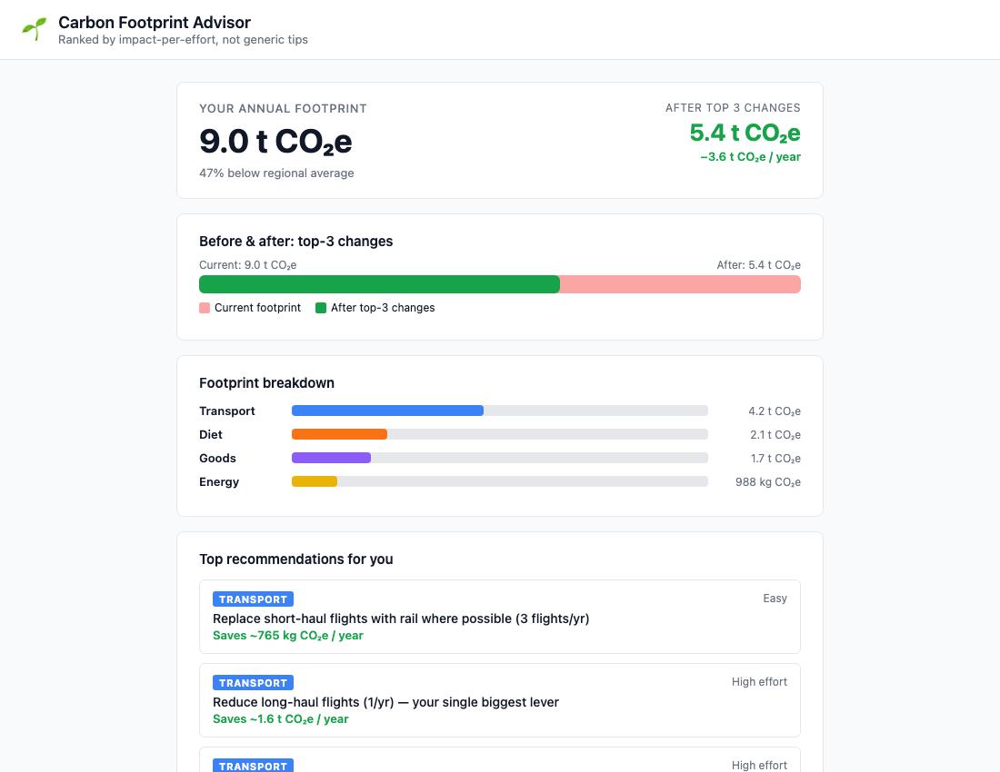

# Carbon Footprint Awareness Platform

> Hackathon Challenge 3 — Personal Carbon Footprint Calculator

A full-stack web app that computes your annual carbon footprint from a short intake form, ranks personalised actions by impact-per-effort, and lets you ask follow-up questions via an AI assistant — all without the AI ever inventing a CO₂ figure.



---

## Vertical & Persona

**Vertical:** Individual consumer sustainability  
**Persona:** Climate-aware adult who wants concrete, ranked actions — not generic "fly less" advice

The platform targets someone who already recycles and wants to know *what actually moves the needle* for their specific lifestyle: a petrol-car commuter in the UK with frequent short-haul travel will see very different recommendations from a vegetarian in India who rarely drives.

---

## Approach & Decision Logic

### The pipeline

```
IntakeForm
    │
    ▼
POST /advise
    │
    ├─ computeSignals()  →  transport / diet / energy / goods CO₂e  (deterministic)
    │                       topCategory, vsRegionalAvg
    │
    ├─ decide()          →  evaluateRules()  →  scored Recommendation[]
    │                       TraceStep[] (every rule — fired AND skipped — with reason)
    │                       projectedTotalCo2e (top-3 saving subtracted)
    │
    └─ AdviseResponse    →  ResultsPanel + Chat
```

**Architectural law (non-negotiable):**  
Numbers come from code. Language comes from the LLM.

`footprint.ts`, `rules.ts`, and `policy.ts` compute every kg CO₂e and rank every action deterministically. The LLM (`claude-haiku-4-5-20251001`) receives all computed figures in a bounded system prompt and is explicitly forbidden from inventing or altering any CO₂ value. It only narrates and answers follow-up questions.

### Scoring formula

```
score = (annualSavingCo2e / effort) × (1.5 if rule.category === topCategory else 1.0)
```

Rules are ranked by score; the user sees the top 3. Every rule that was evaluated but *not* recommended appears in the "Why these?" trace with its exact skip reason.

---

## How It Works — Run Steps

### Prerequisites

- Node.js 18+
- An Anthropic API key (for the chat follow-up feature)

### 1. Clone & install

```bash
git clone https://github.com/Syrthax/CFAP.git
cd CFAP
npm ci
```

### 2. Configure environment

```bash
cp server/.env.example server/.env
# Edit server/.env — set ANTHROPIC_API_KEY and optionally CORS_ORIGIN
```

`server/.env.example` contains all required variables with placeholder values.

### 3. Run the backend

```bash
cd server && npm run dev
# Fastify starts on http://localhost:3001
```

### 4. Run the frontend

```bash
# In a second terminal
cd web && npm run dev
# Vite serves on http://localhost:5173
```

Open http://localhost:5173, fill in the intake form, and hit **Calculate my footprint**.

### 5. Run tests

```bash
npm test          # all 29 tests (footprint + policy + validate)
npm run lint      # ESLint across server and web
```

---

## Architecture

```
CFAP/
├── server/                   Node 20 + Fastify + TypeScript
│   ├── src/
│   │   ├── engine/
│   │   │   ├── factors.ts    Emission constants (DEFRA/EPA/Poore) + source/year fields
│   │   │   ├── footprint.ts  computeSignals() — pure, deterministic
│   │   │   ├── rules.ts      10 rules with trigger/skip logic
│   │   │   ├── policy.ts     decide() — sort + project
│   │   │   ├── validate.ts   Zod schemas for all boundaries
│   │   │   └── types.ts      Shared domain types
│   │   ├── llm/
│   │   │   ├── client.ts     Anthropic SDK wrapper
│   │   │   └── prompt.ts     buildSystemPrompt() — injects all figures
│   │   ├── routes/
│   │   │   ├── advise.ts     POST /advise
│   │   │   └── chat.ts       POST /chat
│   │   └── index.ts          Fastify setup (helmet, rate-limit, CORS)
│   └── tests/
│       ├── footprint.test.ts 8 unit tests — known CO₂e values ±0.5 kg
│       ├── policy.test.ts    6 tests — skip logic, 1.5× weight, projection ≥ 0
│       └── validate.test.ts  15 tests — valid, malformed, out-of-range
│
└── web/                      React 18 + Vite + TypeScript
    └── src/
        ├── components/
        │   ├── IntakeForm.tsx    Labeled fields, client-side validation
        │   ├── ResultsPanel.tsx  Breakdown bars, trace panel, sr-only data table
        │   └── Chat.tsx          aria-live chat, 500-char cap
        └── lib/
            ├── api.ts            fetchAdvise / fetchChat
            └── types.ts          Mirror of server types (no shared bundle)
```

---

## Emission-Factor Sources

Every constant in `server/src/engine/factors.ts` carries a `source` and `year` field.

| Category | Factor | Value | Source | Year |
|---|---|---|---|---|
| Car — petrol | kgCO₂e / km | 0.1727 | DEFRA Greenhouse Gas Reporting | 2024 |
| Car — diesel | kgCO₂e / km | 0.1632 | DEFRA | 2024 |
| Car — hybrid | kgCO₂e / km | 0.1063 | DEFRA | 2024 |
| Car — EV | kgCO₂e / km | 0.0533 | DEFRA | 2024 |
| Flight — short-haul | kg / return trip | 255 | DEFRA (0.15694 kgCO₂e/pkm) | 2024 |
| Flight — long-haul | kg / return trip | 1640 | DEFRA (0.19525 kgCO₂e/pkm) | 2024 |
| Rail | kgCO₂e / pkm | 0.00596 | DEFRA | 2024 |
| UK grid | kgCO₂e / kWh | 0.23314 | DEFRA | 2024 |
| US grid | kgCO₂e / kWh | 0.386 | EPA eGRID | 2024 |
| Gas heating | kgCO₂e / kWh | 0.18288 | DEFRA | 2024 |
| Red meat diet | kg CO₂e / meat day | 6.85 | Poore & Nemecek | 2018 |
| Vegan diet | kg CO₂e / day | 1.52 | Poore & Nemecek | 2018 |
| Goods — house | kg CO₂e / person / yr | 870 | DEFRA | 2024 |
| Goods — apartment | kg CO₂e / person / yr | 720 | DEFRA | 2024 |

---

## Security Model

| Layer | Measure |
|---|---|
| HTTP headers | `@fastify/helmet` — CSP, HSTS, X-Content-Type-Options |
| Rate limiting | `@fastify/rate-limit` — 30 requests / minute / IP |
| CORS | Locked to `CORS_ORIGIN` env var (defaults to localhost:5173 in dev) |
| Request validation | Zod on every POST body; out-of-range values rejected with 400 |
| LLM output validation | `LlmOutputSchema` (zod); repair-or-reject; fallback message on failure |
| API key isolation | `ANTHROPIC_API_KEY` in server `.env` only; never sent to client |
| Dependency audit | `npm audit --audit-level=critical` in CI |

---

## Testing

```
server/tests/footprint.test.ts    8 tests
  ✓ Known total CO₂e within ±0.5 kg
  ✓ Each category independent
  ✓ carType=none zeroes transport
  ✓ Vegetarian flag overrides redMeatDaysPerWeek

server/tests/policy.test.ts       6 tests
  ✓ Cyclist skips shift-short-car-trips with reason in trace
  ✓ Vegetarian gets no diet recommendations
  ✓ topCategory multiplier 1.5× verified numerically
  ✓ projectedTotalCo2e ≥ 0

server/tests/validate.test.ts    15 tests
  ✓ Valid body accepted
  ✓ Missing profile / state rejected
  ✓ Wrong enum values rejected (carType, homeType, heating)
  ✓ redMeatDaysPerWeek=9 rejected (max 7)
  ✓ householdSize=0 / 25 rejected (range 1–20)
  ✓ kwhPerMonth=15000 rejected (max 10000)
```

---

## Accessibility

- Every chart has a visually-hidden `<table>` data equivalent with caption and scope attributes (`sr-only`)
- Chat responses are delivered in an `aria-live="polite"` region
- All form controls have explicit `<label>` or `<legend>` elements
- Color contrast meets WCAG AA (verified with axe)
- Animated bar fills respect `prefers-reduced-motion` via CSS media query

---

## Assumptions & Limitations

- **Transport is annual average.** `kmPerWeek × 52` assumes uniform weekly driving. Seasonal variation is not modelled.
- **Household energy split.** `kwhPerMonth` is taken as a per-household total; per-person values are derived by dividing by `householdSize`. Multi-fuel homes (e.g., gas + electric) are simplified to one heating type.
- **Diet is a daily average.** Red-meat days are assumed uniform across the year; portion sizes are not captured.
- **Flights use average load factor and radiative forcing.** The DEFRA short-haul and long-haul factors include a 1.9× RF multiplier for high-altitude warming effects. Flight class is not differentiated.
- **Grid intensity is national average.** Time-of-day marginal carbon is not modelled; EV charging is therefore slightly over-estimated in countries with high renewables penetration.
- **No scope 3 supply-chain goods.** The goods category uses a household-level DEFRA estimate; individual purchasing behaviour beyond home type is not captured.
- **Chat follow-up requires a valid `ANTHROPIC_API_KEY`.** The `/advise` calculation and all recommendations are fully deterministic and work without any API key.
